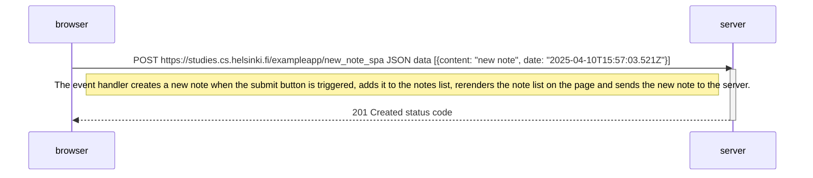

```mermaid
sequenceDiagram
participant browser
participant server


    browser->>server: POST https://studies.cs.helsinki.fi/exampleapp/new_note_spa JSON data [{content: "new note", date: "2025-04-10T15:57:03.521Z"}]
    activate server

     Note right of browser: The event handler creates a new note when the submit button is triggered, adds it to the notes list, rerenders the note list on the page and sends the new note to the server.

    server-->>browser: 201 Created status code
    deactivate server

```
